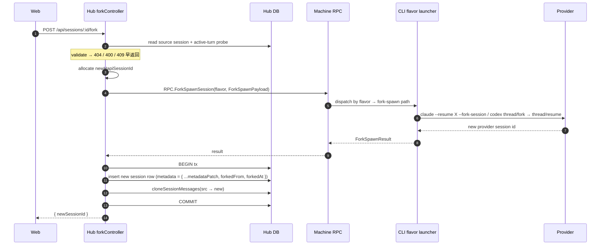

# Session Fork — Design

**Date:** 2026-06-28
**Status:** Design — pending implementation
**Repo:** `mouriya-s-lab/hapi` (fork of `tiann/hapi`)

## Goal

为 hapi 增加 session fork 能力：用户在 web 点 Fork → cli 用 provider 原生 fork 命令 fork → hapi 数据库 clone session row + messages → web 出现两个独立 session，互不干扰。

## Scope

### In scope (MVP)

- **Head fork only** —— "fork 当前 session 到一个新 session"，不区分到哪条消息
- **Claude** (`claude --resume X --fork-session`) 与 **Codex** (`thread/fork`) 两个 provider
- Web 单一入口（SessionActionMenu Fork 项）
- Hub 侧统一 DB clone 逻辑（不分 flavor）
- Capability-aware UI（不支持 fork 的 flavor 自动隐藏按钮）

### Out of scope

- **Message-level fork**（"fork before this user message"）—— 是 `/rewind` 的实现路径，独立 UX 与入口，留到后续
- **cursor / gemini / opencode / kimi / omp** 的 fork —— 本期不注册 fork capability
- **Active turn 中 force-fork** —— MVP 拒绝（409），未来若需要加 `?force=1` query

## Architecture

### Capability registry (cli 侧)

`fork-features/session-fork/providerRegistry.ts`：

```ts
interface ForkSpawnPayload {
  sourceMetadata: SessionMetadata           // shared 层
  sourceCwd: string
  sourceModel?: string
  sourcePermissionMode?: PermissionMode
  sourceCollaborationMode?: CollaborationMode
  newHapiSessionId: string                  // hub 预分配
}

interface ForkSpawnResult {
  providerSessionId: string
  metadataPatch: Partial<SessionMetadata>
}

interface ForkProvider {
  spawnFork(payload: ForkSpawnPayload): Promise<ForkSpawnResult>
}

const FORK_PROVIDERS = new Map<Flavor, ForkProvider>()
export function registerForkProvider(flavor: Flavor, provider: ForkProvider): void
export function getForkProvider(flavor: Flavor): ForkProvider | undefined
export function listForkCapableFlavors(): Flavor[]
```

未来 rewind 在同目录新建 `rewindRegistry.ts`，与 fork 完全独立。

接口签名约束：
- 传 `SessionMetadata`（shared 层，cli 已用），**不传整个 `StoredSession`**（hub 内部 type，跨层 leak 不合适）
- Provider 各自挑用得上的字段，不强制读全部

### Code layout

```
fork-features/session-fork/
├── providerRegistry.ts          # 接口 + Map<Flavor, ForkProvider>
├── register.ts                  # cli 启动入口 side-effect import
├── providers/
│   ├── claudeFork.ts            # Claude ForkProvider 实现
│   └── codexFork.ts             # Codex ForkProvider 实现
├── hubForkController.ts         # hub 业务逻辑
├── hubMount.ts                  # export mountForkRoutes(app, syncEngine)
└── trunk-patches.md             # 登记 upstream 文件改动
```

### Trunk patches（5 处，最小集）

| 文件 | 改动 | 行数 |
|---|---|---|
| `hub/src/web/server.ts` | `import { mountForkRoutes } from '../../fork-features/session-fork/hubMount'; mountForkRoutes(app, syncEngine)` | 2 |
| `shared/src/schemas.ts` | SessionMetadata zod 加 `forkedFrom?: string`、`forkedAt?: number` | ~3 |
| `web/src/components/SessionActionMenu.tsx` | "Fork session" 菜单项 + onClick | ~5 |
| `web/src/hooks/mutations/useSessionActions.ts` | 暴露 `forkSession` mutation | ~5 |
| cli 启动入口（如 `cli/src/index.ts`） | `import 'fork-features/session-fork/register'` | 1 |

完整 hub 路由声明 + handler + Hono 全在 `fork-features/session-fork/hubMount.ts`，不动 `hub/src/web/routes/sessions.ts`。所有 trunk patches 登记在 `fork-features/trunk-patches.md` 供 rebase 复审。

Hub 无 plugin/route registry（确认 via grep），自己发明一个会让 rebase 更脆 → 接受 trunk patch、压到最薄。

## Control flow



## Provider implementations

### Claude (`fork-features/session-fork/providers/claudeFork.ts`)

- spawn `claude --resume <sourceClaudeSessionId> --fork-session` 作为 launcher 主进程，hapi 这边 session id = `newHapiSessionId`
- 等 init message emit 出新 Claude `sessionId` → `metadataPatch.claudeSessionId`
- 进程继续作为 forked session 的常驻 runner
- fork 与 spawn 在 CLI 层耦合（Claude 没有"只 fork 不 run"原语）；上游 PR #942 已验证此调用形态可行

### Codex (`fork-features/session-fork/providers/codexFork.ts`)

- 调 app-server `thread/fork`（不传 turn 偏移 = fork at head）拿 `newThreadId`
- 调 `thread/resume(newThreadId)` 启动 launcher
- `metadataPatch = { codexSessionId: newThreadId, codexThreadId: newThreadId }`
- 比 Claude 干净，协议层 fork 是独立 RPC

## DB operations

### 新增 helper `cloneSessionMessages(srcId, dstId)`

`hub/src/store/messages.ts` 已有 `copyMessageToSession`、`mergeSessionMessages`，但缺"全量克隆消息到新 session"。新增（属于 fork-features 业务，避免改 store 文件，可放 `hubForkController.ts` 内部，使用现有 `copyMessageToSession` primitive 实现）：

```ts
cloneSessionMessages(srcSessionId: string, dstSessionId: string): { copied: number }
```

实现：`SELECT * FROM messages WHERE session_id = src ORDER BY seq` → 用 `copyMessageToSession` 逐条插入 dst。整段包在 hub 调用方的同一 transaction。

### 新 session 字段策略

| 字段 | 复制 | 新生成 | 新增 |
|---|---|---|---|
| `id` | | ✓ (`newHapiSessionId`) | |
| `claudeSessionId / codexSessionId / codexThreadId` | | ✓ (from `metadataPatch`) | |
| `model / permissionMode / collaborationMode / cwd` | ✓ | | |
| `title` | ✓ + " (fork)" 后缀 | | |
| `forkedFrom` | | | ✓ = srcSessionId |
| `forkedAt` | | | ✓ = `Date.now()` |
| `active / runner state` | | ✓ (新 session 自己) | |

Title rule：source title + " (fork)"。Fork-of-fork → "X (fork) (fork)"——接受，干净规则比聪明去重重要。

## UI entry

### SessionActionMenu

在三点菜单加 "Fork session" 项，位置在 Archive 上方。onClick → `useSessionActions().forkSession(srcId)` → POST → 成功后 navigate 到新 sessionId。

### Capability gating

新增 hub endpoint `GET /api/flavors/capabilities`：

```json
{ "fork": ["claude", "codex"] }
```

Web 用 React Query 缓存。SessionActionMenu 渲染时按 `session.metadata.flavor` 是否在 fork list 决定是否显示 Fork 项。不在 list 的 flavor（cursor/gemini/opencode/kimi/omp）自动隐藏。

## Active turn 行为

MVP 拒绝（409 `"wait for current turn to complete"`）。

理由：Codex/Claude 在 active turn 时 fork 都可能拿到 in-flight 不完整 state，新 session 起点不可控。推迟开放比错放回收便宜。未来如要 force-fork 加 `?force=1` query。

## Errors

| 场景 | HTTP | UI |
|---|---|---|
| source 不存在 | 404 | toast |
| flavor 无 fork capability | 400 | 按钮 capability-隐藏，4xx 防御 |
| machine offline | 503 | toast |
| source active turn | 409 | toast "等当前 turn 结束" |
| provider fork 失败 | 502 | toast + provider message |
| spawn 成功但 DB clone 失败 | 500，tx rollback + 后台 best-effort kill launcher | toast "fork 失败，请重试" |

## Testing

### Unit

- `fork-features/session-fork/providers/claudeFork.test.ts` — mock claude binary spawn，断言 args + init message 解析 → `metadataPatch`
- `fork-features/session-fork/providers/codexFork.test.ts` — mock codex app-server client，断言 `thread/fork` → `thread/resume` 调用序列
- `fork-features/session-fork/hubForkController.test.ts` — DB clone、metadata 写入、error 路径 4xx/5xx、tx rollback
- web 侧 — `useSessionActions.forkSession` 成功后 navigate；SessionActionMenu capability gating

### E2E（按 `runtime-verification-required` rule，必须真跑）

启 hapi local（hub + cli + web），用 `agent-browser` skill 在 web 端跑：

1. 用真 claude binary 启一个 session，发 3 条消息（含一条 tool call）
2. 点 Fork → 验证：
   - new session 出现在 sidebar
   - new session metadata: `forkedFrom = srcId`, `forkedAt` 非空, `claudeSessionId ≠ src.claudeSessionId`
   - new session messages 完整 clone（3 条都在）
   - source session 不受影响（消息数、id 不变）
3. source 发新消息 A，new 发新消息 B，验证两边互不出现对方消息
4. Codex 重复 1–3

## Acceptance criteria

- [ ] cli 单测通过（claudeFork、codexFork）
- [ ] hub 单测通过（hubForkController、cloneSessionMessages、capability endpoint）
- [ ] web 单测通过（useSessionActions.forkSession、SessionActionMenu gating）
- [ ] E2E Claude fork 跑通：两 session 独立、消息互不影响（agent-browser 截图存证）
- [ ] E2E Codex fork 跑通：同上
- [ ] cursor/gemini/opencode/kimi/omp session 上 Fork 按钮不显示
- [ ] active turn 中点 Fork 返回 409
- [ ] machine offline 时 Fork 返回 503
- [ ] DB clone 失败时新 session row 不留残留（tx rollback 验证）
- [ ] trunk patches 登记在 `fork-features/trunk-patches.md`
- [ ] sync-upstream workflow 跑一次，trunk patch 不冲突或冲突可手解
